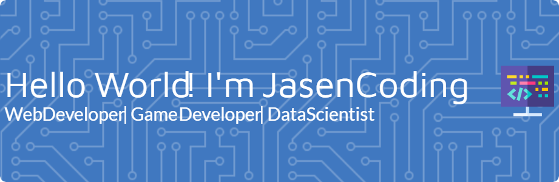

### ✍️ Random Developer Quote

---

### 💫 About Me:
👋 Hello! I'm JasenCoding I am a passionate Programmer with a strong focus on Web Development and Game Development. My journey in technology is driven by curiosity and a deep commitment to crafting impactful, user-centric applications.  🔭 Currently Working On: Developing scalable software solutions with clean, maintainable code.  Exploring emerging technologies to deliver modern, efficient web applications.  🌱 Currently Learning: Web Development: Mastering HTML, CSS, JavaScript, and modern frameworks like React and Bootstrap.  Game Development: Designing immersive experiences with Unity and C#, focusing on game mechanics and interactive storytelling.  👯 Looking to Collaborate On: Open-source projects in web and game development.  Cutting-edge technologies that solve real-world challenges.  🤝 Seeking Guidance On: Advanced backend development and performance optimization.  Best practices for large-scale application deployment.  💬 Ask Me About: Front-end development, responsive design, and interactive UI/UX.  Game design principles, Unity development, and C# scripting.  😄 Pronouns: 01001000 01100101 (He) | 01010011 01101000 01100101 (She) | 01010100 01101000 01100101 01111001 (They)  ⚡ Fun Fact: Did you know that coding is like magic? Every line you write is a spell, turning logic into reality. When I’m not coding, I’m exploring game mechanics, experimenting with new technologies, and diving into open-source projects. I also love challenging myself with coding competitions and building small projects to sharpen my skills. My dream? To craft software that not only solves problems but also inspires creativity and innovation.😊😊
<!--
**JasenCoding/JasenCoding** is a ✨ _special_ ✨ repository because its `README.md` (this file) appears on your GitHub profile.

Here are some ideas to get you started:

- 🔭 I’m currently working on ...
- 🌱 I’m currently learning ...
- 👯 I’m looking to collaborate on ...
- 🤔 I’m looking for help with ...
- 💬 Ask me about ...
- 📫 How to reach me: ...
- 😄 Pronouns: ...
- ⚡ Fun fact: ...
-->

### 💻 Tech Skill Stack:

###### Languages

##### Databases

##### Framework & Library

##### Design

##### IDE Editor

##### OS

### 🌐 My Socials Media:
   

### 📊 GitHub Stats:
 
 

### 🏆 GitHub Trophies

<h2 align="left">Play games with me</h2>

<picture>
  <source media="(prefers-color-scheme: dark)" srcset="https://raw.githubusercontent.com/JasenCoding/JasenCoding/output/pacman-contribution-graph-dark.svg">
  <source media="(prefers-color-scheme: light)" srcset="https://raw.githubusercontent.com/JasenCoding/JasenCoding/output/pacman-contribution-graph.svg">
  
</picture>

###

###

<!-- Proudly created with GPRM ( https://gprm.itsvg.in ) -->

